<p align="center">
  <a href="https://raynerdcunha.vercel.app"></a>
</p>

<p align="center">
  <a href="https://raynerdcunha.vercel.app"></a>
  <a href="LICENSE"></a>
</p>

<p align="center">
  
  
  
  
  
  
  
</p>

# Rayner's Domain: Portfolio Website

The source code for [raynerdcunha.vercel.app](https://raynerdcunha.vercel.app), the personal portfolio of **Rayner Dcunha** (Computer Engineering co-op, University of Alberta).

It's a dark, animated, multi-page static site with **no framework and no build step**: plain HTML, CSS and JavaScript. You can download it, run it locally and use it as a starting point for your own portfolio.

---

## Features

- **Interactive skills knowledge graph**: a live physics simulation written from scratch (no graph library). Drag nodes, hover to see where a skill was used, click a category to hide it.
- **Serverless contact form**: Google Apps Script emails each message to you and sends the visitor a confirmation. No backend server, and visitors don't sign in.
- **"My side / your side" panel**: the owner's local time and weather next to the visitor's ([Open-Meteo](https://open-meteo.com), free, no API key, no location prompt).
- **GSAP motion**: page-wipe transitions, decode-text intro, scroll reveals, magnetic buttons, 3D card tilt.
- **Clean URLs** (`/projects`, `/skills`) that work on Vercel and any static server.

**Tech:** HTML · CSS · JavaScript · GSAP + ScrollTrigger (bundled) · SVG / Canvas · Google Apps Script · Vercel

---

## Run it locally

You only need a browser and Python (or any static file server).

```bash
git clone https://github.com/raynerdcunha/portfolio-website.git
cd portfolio-website
python -m http.server 8000
```

Then open **http://localhost:8000**.

> Open it through a local server like the one above, not by double-clicking `index.html`. The pages use root paths (`/assets/...`) that only resolve when served.

---

## Project structure

```text
├── index.html                      # Home
├── experience/index.html           # Experience, leadership, awards
├── projects/index.html             # Project cards (filterable)
├── skills/index.html               # Knowledge graph + list view, certifications
├── contact/index.html              # Contact form + links
├── 404.html                        # "Lost in the Domain?"
├── assets/
│   ├── css/main.css                # All styles; colour tokens are at the top
│   ├── js/
│   │   ├── motion.js               # Taskbar, page wipe, intro, scroll reveals, tilt, magnetic buttons
│   │   ├── site-shell.js           # Loader, card glow, counters, typed text
│   │   ├── space-network.js        # Home background
│   │   ├── time-weather.js         # Time + weather panel
│   │   ├── project-effects.js      # Project filters, terminal animation
│   │   ├── skills-data.js          # Skills content (graph + list read from here)
│   │   ├── skills-graph.js         # Knowledge graph engine
│   │   └── contact-form.js         # Form validation + sending
│   ├── vendor/                     # GSAP + ScrollTrigger
│   ├── images/                     # Favicon, social preview image
│   └── resume/                     # Résumé PDF
├── google-apps-script/
│   └── contact-form-receiver.gs    # Contact form backend (runs on script.google.com)
├── docs/readme-banner.svg          # README banner
├── LICENSE                         # MIT (code) + content copyright
├── vercel.json                     # Clean URLs, security headers, caching
└── .vercelignore                   # Keeps the script, docs + README out of the deploy
```

---

## Make it your own

The text, résumé and branding in this repo belong to Rayner Dcunha (see [License](#license)). Replace them before you publish your own version.

| Change | Where |
|---|---|
| Name, intro, profile card, stats | `index.html` |
| Jobs, leadership, awards | `experience/index.html` |
| Projects | `projects/index.html` |
| Skills (graph + list) | `assets/js/skills-data.js`: each skill lists where you used it, and node size grows with that count |
| Certifications | `skills/index.html` |
| Links + availability | `contact/index.html` and the taskbar in every page |
| Résumé | `assets/resume/`, then update the links that point to it |
| Colours | CSS variables at the top of `assets/css/main.css` |
| Logo / favicon | `assets/images/rd-logo.svg`, `favicon-32.png`, `apple-touch-icon.png` |
| Your city for time/weather | the `ME` coordinates and time zone at the top of `assets/js/time-weather.js` |
| Site URL | `canonical` / `og:` tags in each page, `sitemap.xml`, `robots.txt` |

The taskbar is copied into each page. If you add or rename a page, update it in all of them.

---

## Set up the contact form (your own inbox)

1. Sign in to the Google account that should send the emails, go to [script.google.com](https://script.google.com) and click **New project**.
2. Paste in everything from `google-apps-script/contact-form-receiver.gs`. Set `OWNER_NAME`, `SITE_URL` and (optionally) `DELIVER_TO` at the top, then **Save**.
3. **Deploy → New deployment →** gear icon **→ Web app**. Set Execute as **Me** and Who has access **Anyone**, then **Deploy**.
4. Click **Authorize**, choose your account, then **Advanced → Go to project → Allow**. Google shows this warning because the script is your own and unverified, which is expected.
5. Copy the **Web app URL** (it ends in `/exec`) into the form's `action="..."` in `contact/index.html`.

When you edit the script later, go to **Deploy → Manage deployments → Edit → New version**. The URL stays the same.

The script has a spam trap and rate limits built in: one message per sender every 2 minutes, and a daily cap. Until the URL is set, the form falls back to opening the visitor's email app.

---

## Deploy on Vercel

1. Push the project to your own GitHub repo.
2. In [Vercel](https://vercel.com), go to **Add New → Project** and import the repo.
3. Use these settings:
   - **Framework Preset:** Other
   - **Build Command:** *(empty)*
   - **Output Directory:** *(empty)*
   - **Install Command:** *(empty)*
4. Click **Deploy**. After that, every push to `main` redeploys automatically.

Any other static host (Netlify, GitHub Pages, Cloudflare Pages) works too. `vercel.json` only adds Vercel-specific extras.

---

## Notes

- Designed for laptop and desktop screens; phones get a basic stacked layout.
- Animations always run, even when the OS "reduce motion" setting is on (a design choice; change it in the JS files if you prefer).

---

## License

- **Code** (HTML, CSS, JavaScript and the Apps Script): [MIT License](LICENSE). You're free to use, modify and share it.
- **Personal content**: the name, biography, experience, project descriptions, résumé, photos and "Rayner's Domain" / RD branding are **© 2026 Rayner Dcunha. All rights reserved.** They are not covered by the MIT License. Please replace them with your own.
- **GSAP** in `assets/vendor/` is © GreenSock and is used under the [GSAP Standard License](https://gsap.com/standard-license), not the MIT License.

If this repo helped you build your portfolio, a link back is appreciated but not required.
